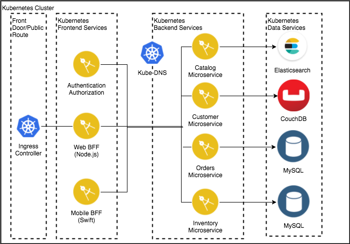

<!--
#
# Copyright 2019 IBM Corporation
#
# Licensed under the Apache License, Version 2.0 (the "License");
# you may not use this file except in compliance with the License.
# You may obtain a copy of the License at
#
#     http://www.apache.org/licenses/LICENSE-2.0
#
# Unless required by applicable law or agreed to in writing, software
# distributed under the License is distributed on an "AS IS" BASIS,
# WITHOUT WARRANTIES OR CONDITIONS OF ANY KIND, either express or implied.
# See the License for the specific language governing permissions and
# limitations under the License.
-->

# SolSA in Action: BlueCompute

## Application Overview

[BlueCompute](https://github.com/ibm-cloud-architecture/refarch-cloudnative-kubernetes)
was developed by the IBM Cloud Garage as a reference implementation
for building a Cloud Native Microprofile Web Application using a
Microservices architecture on a Kubernetes cluster. The application is
a simple store front shopping application that displays a catalog of
antique computing devices, where users can search and buy products.
It has a Web interface, and it relies on BFF (Backend for Frontend)
services to interact with the backend data. The logical architecture
for this reference implementation is shown in the picture below.

    

## SolSA Features

We use BlueCompute to demonstrate several aspects of SolSA.

1. SolSA's TypeScript/JavaScript binding for the entire Kubernetes API
enables the application developer to utilize all the capabilities of
the underlying Kubernetes platform from a familiar IDE-environment and
programming language. The application is composed using standard
Kubernetes building blocks such as `Deployment`, `ConfigMap`, and
`Secret`, but rich IDE-support enabled by TypeScript enables
developers less familiar with the low-level YAML specification of
these resources to be more productive.

2. SolSA's Kubernetes support goes beyond just wrapping the core
Kubernetes resources by adding several additional features that make
defining BlueCompute even more concise and less error-prone.
   a. All `Service` resources are derived from the `Deployment` they
      are fronting via "one-liners" that simply invoke the
      `getService()` method added to `Deployment` by SolSA.

   b. Similarly, an `Ingress` is derived directly from the `Service`
      it is exposing by just invoking the Service's `getIngress`
      method. SolSA automatically handles the cluster-specific details
      of specifying vhosts, service ports, paths, and tls
      configuration.

   c. Redundancy is reduced by using the `propagateLabels` method that
      SolSA adds to `Deployment` to ensure that the `Deployment` and
      `PodSpec` metadata always matches.

3. This application also illustrates a recommended SolSA idiom for
   combining multiple sub-components into a coherent application.
   Each logical component of the application is defined in its own
   JavaScript file that exports a single function. A
   `BlueComputeConfig` class plays a similar role to the `values.yaml`
   file of a Helm chart by abstracting instance-specific configuration
   values (In fact, the bulk of BlueComputeConfig is simply a wrapper
   around a `bluecompute-values.yaml` file that was derived from the
   `values.yaml` files of the Helm charts originally used to deploy
   the sub-components). The top-level file, bluecompute.js,
   instantiates an instance of `BlueComputeConfig` and then invokes
   each sub-component function to construct the overall application.

4. SolSA includes an importer tool that is able to load YAML/json
   files and convert them to use SolSA's JavaScript bindings for
   Kubernetes.  This importer was used to reduce the effort needed to
   convert from the original Helm Charts to the SolSA definition of
   the application.  The `importer` subdirectory contains the
   artifacts created during the import process.

## Deployment

Deploy the application with `solsa yaml bluecompute.js | kubectl apply -f -`

After about a minute, you can open the URL of the created ingress
in a web browser.

You can login to the application using the username `foo` and the password `bar`.

You should be able to browse the catalog, order items, and view your
profile which includes your order history.
