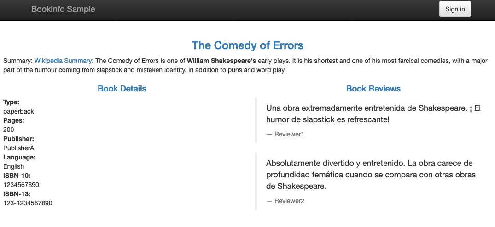

<!--
#
# Copyright 2019 IBM Corporation
#
# Licensed under the Apache License, Version 2.0 (the "License");
# you may not use this file except in compliance with the License.
# You may obtain a copy of the License at
#
#     http://www.apache.org/licenses/LICENSE-2.0
#
# Unless required by applicable law or agreed to in writing, software
# distributed under the License is distributed on an "AS IS" BASIS,
# WITHOUT WARRANTIES OR CONDITIONS OF ANY KIND, either express or implied.
# See the License for the specific language governing permissions and
# limitations under the License.
-->

# SolSA in Action: Bookinfo

Using the Istio project's [Bookinfo sample application](https://istio.io/docs/examples/bookinfo/),
we first show how SolSA can be used to specify the configuration
of an existing containerized microservice-based application.  We then
show how SolSA enables this application pattern to be enhanced by
injecting a new SolSA-defined microservice into the Bookinfo application that
enables book reviews to be presented to the user in a different
language using the Watson Language Translation Service.

When instantiated to translate its reviews into Spanish, the augmented
Bookinfo will appear as shown below.


## Basic Bookinfo

The base Bookinfo applications pattern is specified in SolSA as shown
below (cf. [bookinfo.js](bookinfo.js)):
```javascript
let solsa = require('solsa')

module.exports = function bookinfo () {
  let bundle = new solsa.Bundle()

  bundle.details = new solsa.ContainerizedService({ name: 'details', image: 'istio/examples-bookinfo-details-v1:1.15.0', port: 9080 })
  bundle.ratings = new solsa.ContainerizedService({ name: 'ratings', image: 'istio/examples-bookinfo-ratings-v1:1.15.0', port: 9080 })
  bundle.reviews = new solsa.ContainerizedService({ name: 'reviews', image: 'istio/examples-bookinfo-reviews-v1:1.15.0', port: 9080 })
  bundle.productpage = new solsa.ContainerizedService({ name: 'productpage', image: 'istio/examples-bookinfo-productpage-v1:1.15.0', port: 9080 })
  bundle.productpage.env = {
    DETAILS_HOSTNAME: bundle.details.name,
    RATINGS_HOSTNAME: bundle.ratings.name,
    REVIEWS_HOSTNAME: bundle.reviews.name
  }
  bundle.entry = bundle.productpage.getIngress()

  return bundle
}
```
The code above defines the four component microservices by
indicating their names, container image, and exposed port.
The dependencies from the `productpage` microservice to
the other services are represented explicitly in the specification of
its environment, which captures the names of the services on which
it depends.

An instance of the Bookinfo pattern is instantiated as shown below (cf. [instance.js](instance.js)):
```javascript
const bookinfo = require('./bookinfo')
module.exports = bookinfo()
```

## A Foreign Language Bookinfo

Now that we have defined the basic Bookinfo pattern, we can easily
build an extension that provides the Book Reviews in a different
language using Watson Language Translation. We define the extended
application as shown below (cf. [bookinfo-translator.js](bookinfo-translator.js)):
```javascript
let solsa = require('solsa')
let bookinfo = require('./bookinfo.js')

module.exports = function translatingBookinfo ({ language }) {
  // Create an instance of the basic Bookinfo application pattern
  let bundle = bookinfo()

  // Configure a translating review service
  bundle.translator = new solsa.LanguageTranslator({ name: 'bookinfo-watson-translator' })
  bundle.translatedReviews = new solsa.ContainerizedService({ name: 'reviews-translator', image: 'solsa-reviews-translator', build: __dirname, main: 'reviews-translator.js', port: 9080 })
  bundle.translatedReviews.env = {
    LANGUAGE: { value: language },
    WATSON_TRANSLATOR_URL: bundle.translator.getSecret('url'),
    WATSON_TRANSLATOR_APIKEY: bundle.translator.getSecret('apikey'),
    REVIEWS_HOSTNAME: bundle.reviews.name,
    REVIEWS_PORT: bundle.reviews.port
  }
  bundle.translatedReviews.readinessProbe = { httpGet: { path: '/solsa/readinessProbe', port: bundle.translatedReviews.port } }

  // Modify the Bookinfo productpage to use the translating review service
  bundle.productpage.env.REVIEWS_HOSTNAME = bundle.translatedReviews.name

  return bundle
}
```
The first block of code creates an instance of the basic Bookinfo
application pattern by invoking the `bookinfo` function imported from `bookinfo.js`.

The middle block of code defines a new `reviews-translator`
microservice and configures it to:
1. access its instance of the Watson Language Translator
2. access the original `reviews` microservice to get the reviews
to translate.

The final code snippet updates the environment of the `productpage`
microservice so that it will send its review requests to `translatedReviews`
instead of `reviews`.

Finally, we can instantiate a bookinfo that translates reviews to
Spanish with the snippet (cf. [instance-sp.js](instance-sp.js))
```javascript
const bookinfo = require('./bookinfo-translator')
module.exports = bookinfo({ language: 'spanish' })
```

Note: before using `sosla yaml` to deploy this application, you will first need to build
the container image `solsa-reviews-translator` as described in the next section.

## Inside the reviews-translator microservice

SolSA also supports a low-overhead way to define the implementations for
microservices using the Express.js framework. This enables the
easy definition of services containing small bits of glue logic. The
actual code for the reviews-translator service is a vanilla Express app
whose environment is configured by SolSA to enable usage of the Watson SDK.

The core logic of the reviews-translator service is shown below (see
[reviews-translator.js](reviews-translator.js) for the complete implementation).
```javascript
const express = require('express')
const needle = require('needle')
const LanguageTranslatorV3 = require('ibm-watson/language-translator/v3')

const REVIEWS_HOSTNAME = process.env.REVIEWS_HOSTNAME
const REVIEWS_PORT = process.env.REVIEWS_PORT
const target = process.env.LANGUAGE

const app = express()

const translator = new LanguageTranslatorV3({ version: '2018-05-01', iam_apikey: process.env.WATSON_TRANSLATOR_APIKEY, url: process.env.WATSON_TRANSLATOR_URL })

app.get('/reviews/:product', (request, response) => {
  const product = request.params.product
  const url = `http://${REVIEWS_HOSTNAME}:${REVIEWS_PORT}/reviews/${product}`
  needle('get', url)
    .then(res => {
      return Promise.all(res.body.reviews.map(oneReview => {
        return translator.identify({ text: oneReview.text })
          .then(res => {
            return translator.translate({ text: [oneReview.text], source: res.languages[0].language, target })
              .then(res => {
                oneReview.text = res.translations[0].translation
                return oneReview
              })
          })
      })).then(reviews => {
        response.status(200).send({ reviews: reviews })
      })
    }).catch(err => {
      console.log(err)
      response.status(500).send({ error: (err && err.message) || 'Internal error' })
    })
})
```

To build and publish the container image for the review-translator microservice
to the docker registry associated with your current Kubernetes context by your solsaConfig.yaml,
execute the commands
```shell
sosla build instance-sp.js
solsa push instance-sp.js
```

### Deploying Bookinfo on OpenShift

The `productpage` microservice will fail to run (it will enter into a
CrashLoop) unless it is allowed to execute using the `USER` specified
in its Dockerfile.  This requires you to grant the default service
account in the target namespace the `anyuid` SCC. Do this by executing
the following command:
```shell
oc adm policy add-scc-to-user anyuid -z default
```

